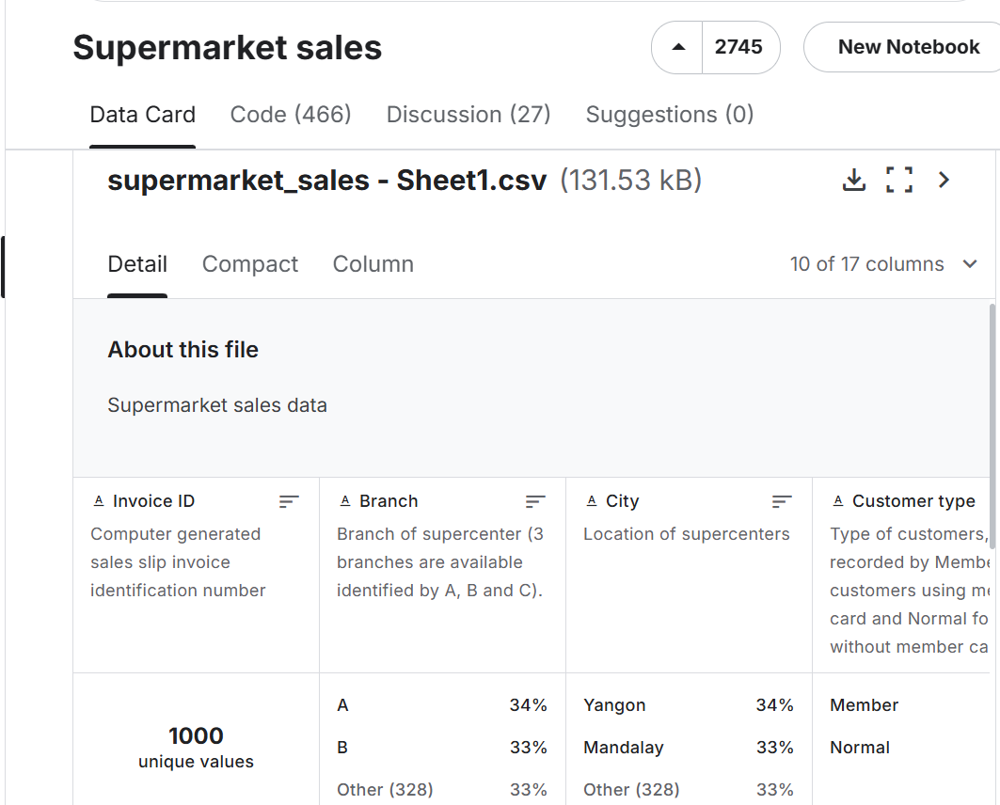
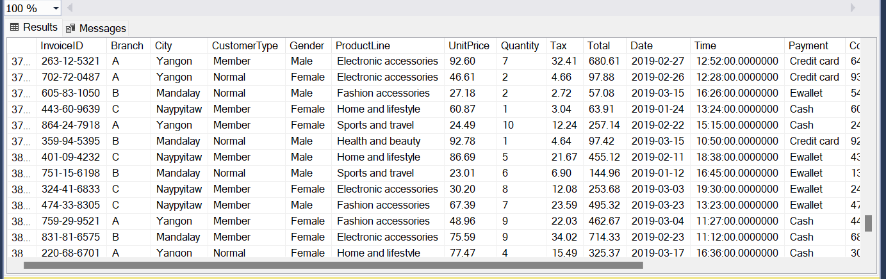
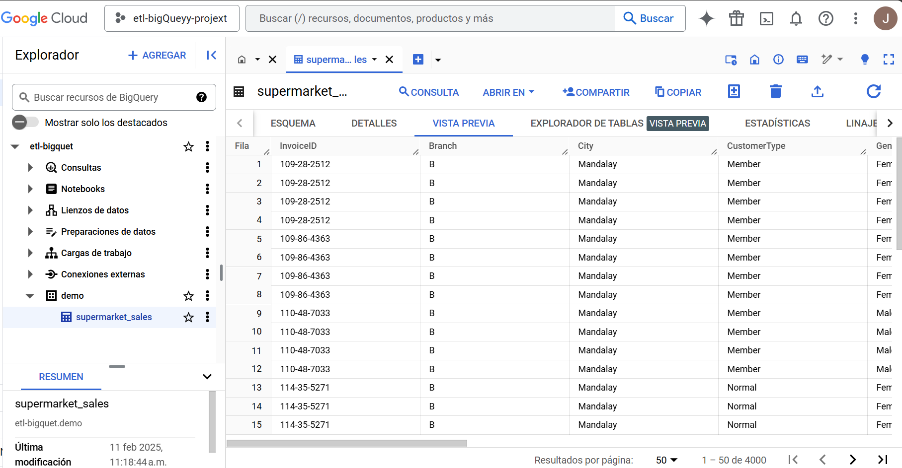

# Proyecto práctica ETL -> SQL SERVER to Google Cloud BigQuery.
### Lo primero ha sido obtener un conjunto de datos, en este caso de kaggle -> https://www.kaggle.com/datasets/aungpyaeap/supermarket-sales
Este csv, se limpia y transfroma con la librería pandas y es subido a una base de datos SQL SERVER.

### Extracción de datos de SQL SERVER
Se obtienen los datos de la base de datos, en este paso también con pandas se guardan en un DataFrame con la estructura que tendrá en bigQuey. 

### Subida a BigQuery
Se establece un Schema a seguir en la tabla y hacemos la subida, autenticando con google cloud y la API de BigQuery.

